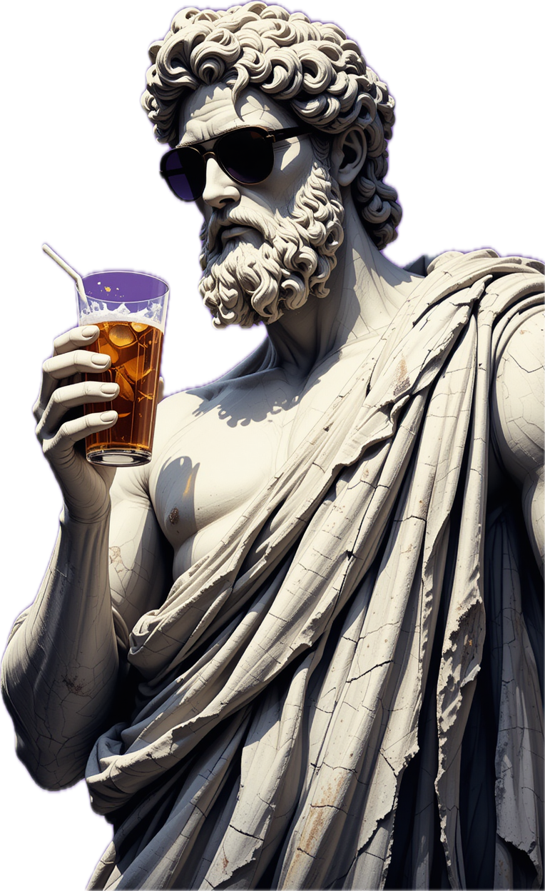
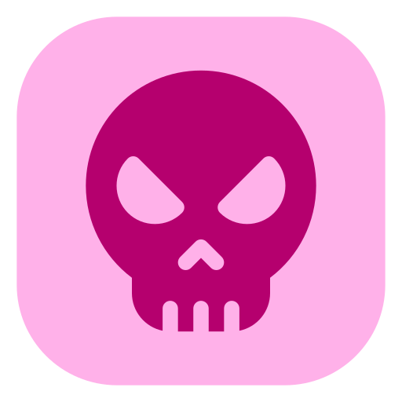

<h1 align="center">✨ Hadi Mohammadi ✨</h1>

  <strong>Backend Developer • Security Enthusiast • Bug Hunter</strong>

---

  

---
### About Me ...
I’m a backend engineer who blends creativity with technology to build meaningful, secure,  
and scalable systems. My main stack revolves around **Laravel** and **.NET**, supported  
by a strong foundation in networking, cybersecurity, and modern web practices.

I see coding as a craft — a way to design something timeless that helps others build,  
create, and innovate.

---
### Tech Stack & Expertise

#### **Backend Development**
- PHP (Laravel)  
- C# (.NET)  
- REST APIs  
- Clean Architecture  

#### **Security & Networking**
- OWASP Top 10  
- CEH, PWK  
- CCNA, CCNP, MCSE  
- Active Bug Hunting  

#### **Frontend**
- React  
- JavaScript  

---
 

  
  
  
  
  
  
  
  
  
  
  
  

---

###  Vision  
To build software that empowers developers, inspires creativity,  
and leaves behind a lasting impact on the tech community.

---
  

---

  <em>Building with purpose. Securing with passion. Growing with curiosity.</em>

